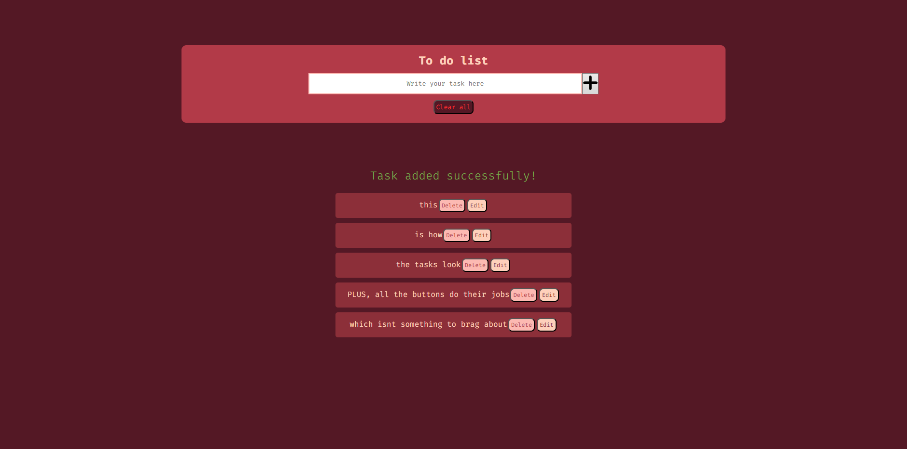

# Hi there!

This is a project i made following the guide in [Rafaella Ballerini](https://github.com/rafaballerini)'s [JS Course](https://youtube.com/playlist?list=PLhkO7OMKgT_rRK3qvJsZAy3jrkupOxD_h&si=9UTUhYgGT5twwtRp).

## Screenshot

I haven't worked in a mobile version yet, so when the resolution changes, i stays the same but the add button gets messed up. I'LL WORK ON IT, PROMISE.

### Where i am, currently:

I just finished part 5, in which she presents the challenge to make the button to clear all the tasklists only visible if there are tasks in the list so i tried to do that by putting style.visibility attributes in the already existing functions.

#### if you're wondering...
 
I'm just writing this in english to practice the language, my first language is portuguese, indeed.